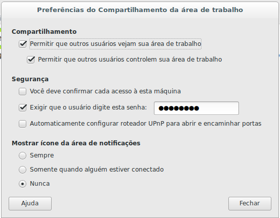

Ubuntu 16 - Vino-Server 
==================================================================================

1- Ao logar com o usuário não root execute:

	vino-preferences

2- Preencha os campos solicitados com as informações abaixo:

	> Compartilhamento
		- Permitir que outros usuários vejam sua aréa de trabalha: true
		- Permitir que outros usuários controlem sua área de trablaho: true
	> Segurança
		- Você deve confirmar cada acesso à esta máquina: false
		- Exigir que o usuário digite esta senha: ******
		- Automaticamente configurar roteador UPnP para abrir e encaminhar portas: false
	> Mostrar ícone da área de notificações: Nunca

	

3- Criar script "vino.sh" para habilitar Vino-Server.

		#!/bin/bash

		exec > vino.log

		export DISPLAY=:0
		gsettings set org.gnome.Vino enabled true
		gsettings set org.gnome.Vino require-password false
		/usr/lib/vino/vino-server &

4- Atribuir permisão de execução ao script

	chmod +x vino.sh

5- Colocar script na inicialização do usuário

	echo "./vino.sh" >> /home/user/.profile 

6- Deslogue e logue novamente com usuário ao qual teve vino-server habilitado.

7- O vino-server será iniciado após o usuário habilitado com o vino-server logar. 
Logo apóso o login, você poderá acessar remotamente por uma vnc-client.
